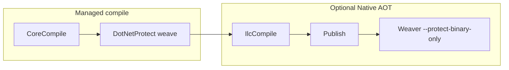

# DotNetProtect

Build-time **IL weaving** for .NET using **Mono.Cecil**: opt-in attributes drive string encryption (AES-256-CBC), primitive literal hiding (XOR `FieldRVA` blobs + `ConstantDecrypt`), control-flow / opaque predicates, anti-debug prologues, optional metadata renaming, integrity checks, and PE/native binary hardening. Designed to work with normal managed builds and **Native AOT** publish (`IlcCompile` runs after the weave).

---

## Table of contents

- [Features](#features)
- [Requirements](#requirements)
- [Repository layout](#repository-layout)
- [How it fits into your build](#how-it-fits-into-your-build)
- [Quick start](#quick-start)
- [Integrating into your project](#integrating-into-your-project)
- [Attribute reference](#attribute-reference)
- [`[FullProtect]` shorthand](#fullprotect-shorthand)
- [MSBuild properties](#msbuild-properties)
- [Weaver command line](#weaver-command-line)
- [Native AOT](#native-aot)
- [Runtime types your app links](#runtime-types-your-app-links)
- [Limitations and caveats](#limitations-and-caveats)
- [Troubleshooting](#troubleshooting)
- [Disclaimer](#disclaimer)
- [License](#license)

---

## Features

| Area | What the weaver does |
|------|----------------------|
| **Strings** | Replaces `ldstr` with encrypted blobs; decrypt at runtime via `StringDecrypt.FromAes256CbcUtf8` |
| **Literals** | Replaces `ldc.i4` / `ldc.i8` / `ldc.r4` / `ldc.r8` (incl. bool-as-`ldc.i4`) with XOR blobs decoded via `ConstantDecrypt` |
| **Control flow** | Injects opaque predicates where `[ObfuscateControlFlow]` / `[ProtectMembers]` apply |
| **Anti-debug** | Injects `AntiDebug.LikelyUnderDebugger` + `Environment.Exit` at method entry where configured |
| **Call indirection** | `[FullProtect]` can rewrite some `call` sites to indirect calls (limited budget, no exception handlers) |
| **Metadata** | Optional rename: per-attribute (`[ObfuscateNames]`), `--rename-private-marked`, or `--full-metadata` |
| **Integrity** | `[assembly: VerifyIntegrity]` embeds keyed SHA-256 over blob payloads; module init verifies |
| **Native coherency** | `[assembly: VerifyNativeExecutableCoherency]` compares mapped image vs on-disk file (AOT-oriented) |
| **PE / binary** | `[assembly: PeProtect]` strips version/info attributes and hardens PE; `--protect-binary-only` patches a native binary after publish |

---

## Requirements

- [.NET 10 SDK](https://dotnet.microsoft.com/download) — all projects target `net10.0`

---

## Repository layout

| Path | Role |
|------|------|
| `src/DotNetProtect` | **Library**: protection attributes + `DotNetProtect.Runtime.*` helpers consumed by woven IL |
| `src/DotNetProtect.Weaver` | **Console app**: `dotnet exec DotNetProtect.Weaver.dll …` post-compilation |
| `build/DotNetProtect.targets` | **MSBuild**: builds the weaver if needed, runs weave `AfterTargets="CoreCompile"` and before `IlcCompile`; optional post-publish native patch |
| `samples/SampleApp` | Example `.csproj` showing `DotNetProtectEnable`, metadata flags, and AOT settings |

---

## How it fits into your build



1. **Managed assembly**: After `CoreCompile`, MSBuild runs the weaver on `$(IntermediateOutputPath)$(TargetFileName)` so the **intermediate** DLL is patched in place (symbols are not read; existing PDB next to output may be deleted as stale).
2. **Native AOT**: The same woven IL is what ILC sees. After `Publish`, an extra step can run `--protect-binary-only` on the emitted native executable.

The weaver does **not** reference your source — only the compiled assembly and a search path to resolve **DotNetProtect** (via `--lib` → `DotNetProtectLibDir` in targets).

---

## Quick start

```bash
# Build everything
dotnet build DotNetProtect.sln -c Release

# Run the sample (IL)
dotnet run --project samples/SampleApp -c Release

# Publish sample with Native AOT (as configured in SampleApp.csproj)
dotnet publish samples/SampleApp -c Release
```

Inspect `samples/SampleApp/Program.cs` for assembly-level attributes, `[FullProtect]`, `[ObfuscateNames]`, `[StringEncrypt]`, and `[Preserve]` examples.

---

## Integrating into your project

1. **Project reference** the library (not the weaver):

   ```xml
   <ItemGroup>
     <ProjectReference Include="path/to/DotnetProtect/src/DotNetProtect/DotNetProtect.csproj" />
   </ItemGroup>
   ```

   Do **not** reference `DotNetProtect.Weaver` from an AOT-published app — that pulls in an executable dependency and can break publish (`NETSDK1150`). The `.targets` file builds the weaver via MSBuild when needed.

2. **Import** the targets at the **end** of your `.csproj` (after other properties you want the weave to see):

   ```xml
   <Import Project="path/to/DotnetProtect/build/DotNetProtect.targets" />
   ```

3. **Enable** weaving:

   ```xml
   <PropertyGroup>
     <DotNetProtectEnable>true</DotNetProtectEnable>
   </PropertyGroup>
   ```

4. Add **attributes** in C# (`[assembly: …]` for assembly-scoped features). See the [attribute reference](#attribute-reference) below.

---

## Attribute reference

Attributes live in the `DotNetProtect` namespace. **`[Preserve]`** excludes a type or member from propagation-based protection and from metadata renaming when those passes are active.

| Attribute | Valid on | Behavior |
|-----------|----------|----------|
| **`StringEncrypt`** | Method, field, class, struct | **Method**: encrypt all string literals in the method. **Field**: `string` instance/static **non-const** initializers (must appear as `ldstr` in `.cctor`/`.ctor`). **Type**: same as marking every eligible method + string fields. Resx strings stay plain unless flow goes through a marked method. |
| **`ObfuscateControlFlow`** | Method | Literal obfuscation (`ldc.*`) + opaque predicates for that method. Stacks with `StringEncrypt`. |
| **`ProtectMembers`** | Class, struct | As if every eligible method had `StringEncrypt` + `ObfuscateControlFlow`, and every eligible `string` field had `StringEncrypt`. Skips special constructors, state-machine guts, entry point, `[Preserve]`. |
| **`InjectAntiDebug`** | Method, class, struct | Debugger check at method start (`LikelyUnderDebugger` → `Environment.Exit`). Runs **before** string/CF so injected constants can be obfuscated when CF applies. |
| **`AntiDebug`** | Assembly, method, class, struct | **Assembly**: every eligible method in the assembly gets the prologue. Otherwise same spirit as `InjectAntiDebug`. |
| **`FullProtect`** | Class, struct | Combines **string encrypt + constant/CF treatment + anti-debug** on eligible methods and string fields, plus **call indirection** on eligible methods. See below. |
| **`ObfuscateNames`** | Type, method, field, property | Opaque renames for non-public targets (type → type + its non-public members unless preserved). Independent of MSBuild rename flags unless `--full-metadata` already renamed everything. |
| **`Preserve`** | Method, field, property, class, struct | Opt out: see XML doc in `PreserveAttribute.cs` (type-level preserve stops class-level propagation but can still allow per-member `[StringEncrypt]` / `[ObfuscateControlFlow]`). |
| **`VerifyIntegrity`** | Assembly | Embeds seed + SHA-256 over concatenated blob `FieldRVA` payloads; module initializer calls `Integrity.VerifyTableOrFail`. |
| **`PeProtect`** | Assembly | Strips cosmetic assembly metadata attributes; PE timestamp/debug directory hardening; optional binary patch pass when writing. Can also be forced with CLI `--pe-protect`. |
| **`VerifyNativeExecutableCoherency`** | Assembly | Module init compares process image mapping to `Environment.ProcessPath` for first *N* bytes (default 512, constructor arg). **AOT-oriented**; skip or tune for IL-only builds. |

**Automatically skipped** (typical): constructors with `IsSpecialName`, compiler-generated iterator/async state machines, assembly entrypoint `Main`, abstract/extern/P/Invoke bodies as implemented in the weaver.

---

## `[FullProtect]` shorthand

On a **class or struct** without `[Preserve]` on the type:

- Same **string** coverage as **class-level `StringEncrypt`** (methods + string fields).
- Same **literal / control-flow** coverage as **`ProtectMembers`** (i.e. `ObfuscateControlFlow` semantics on eligible methods).
- **Anti-debug** prologue like **`InjectAntiDebug`** on the type.
- **Additional**: `IndirectifySomeCallsInMethod` — a small number of direct `call` instructions may become indirect calls (methods with exception handlers are skipped).

Equivalent to stacking **`ProtectMembers`** + **`InjectAntiDebug`** on the same type, **plus** call indirection.

---

## MSBuild properties

Defined in `build/DotNetProtect.targets`. The weaver is invoked roughly as:

`dotnet exec "<WeaverDll>" "<intermediate assembly>" --lib "<DotNetProtect output dir>" [extra args]`

| Property | Default | Effect |
|----------|---------|--------|
| `DotNetProtectEnable` | *(unset)* | Must be `true` for any weave |
| `DotNetProtectStripAttributes` | `false` | `--strip-attributes` vs `--no-strip-attributes` |
| `DotNetProtectRenamePrivateMarked` | `false` | `--rename-private-marked` (ignored if full metadata wins) |
| `DotNetProtectFullMetadata` | `false` | `--full-metadata` (broad internal/private rename; supersedes rename-private-marked) |
| `DotNetProtectAntiDebug` | `false` | Defines `DOTNETPROTECT_ANTIDEBUG` when compiling **your** project so you can wrap extra checks in `#if DOTNETPROTECT_ANTIDEBUG` (IL injection still relies on attributes / `AntiDebug` helpers) |
| `DotNetProtectAotHardening` | `true` | When `PublishAot` is true, sets `StripSymbols` and `IlcDisableReflection` unless you override |

Override `DotNetProtectWeaverDll` or `DotNetProtectLibDir` only if you relocate build outputs.

---

## Weaver command line

Full help: `dotnet exec DotNetProtect.Weaver.dll --help`

| Option | Meaning |
|--------|---------|
| `<assembly.dll>` | Input assembly path (overwritten unless `--output` is set) |
| `--lib <dir>` | Extra assembly resolve directory (repeatable). MSBuild passes the DotNetProtect **library** folder. |
| `--output` / `-o` | Write to another path |
| `--watermark <hex>` | Embed a hex fingerprint as an unreferenced XOR `FieldRVA` blob for leak tracing |
| `--strip-attributes` / `--no-strip-attributes` | Remove or keep `DotNetProtect.*` attributes in output metadata |
| `--rename-private-marked` | Rename private members that carry certain protection markers |
| `--full-metadata` | Rename non-public types, methods, fields, properties (broadest rename) |
| `--pe-protect` | Apply PE/metadata stripping like `[PeProtect]` |
| `--protect-binary-only <path>` | Patch native PE/ELF on disk without IL weave (used after AOT publish in targets) |

**Environment:** `DOTNETPROTECT_ASSEMBLY_SEARCH_PATHS` — `Path.PathSeparator`-separated list of extra resolver directories (optional).

---

## Native AOT

- The weave runs **before** `IlcCompile`, so IL optimizations see encrypted strings and blobs.
- `samples/SampleApp` sets `PublishAot`, `StripSymbols`, and `IlcDisableReflection` — aligned with `DotNetProtectAotHardening` defaults.
- **`[VerifyNativeExecutableCoherency]`** is meant for native single-file style outputs; the sample keeps it commented for plain IL runs.
- After publish, `DotNetProtectPostPublishNativeBinary` may run ` --protect-binary-only` on `$(TargetName)$(NativeBinaryExt)` under `PublishDir`.

---

## Runtime types your app links

Woven IL imports methods from **DotNetProtect** (must be referenced at compile time):

| Helper | Used when |
|--------|-----------|
| `DotNetProtect.Runtime.StringDecrypt` | Any string encryption |
| `DotNetProtect.Runtime.ConstantDecrypt` | Control-flow / literal obfuscation |
| `DotNetProtect.Runtime.AntiDebug` | Injected anti-debug checks |
| `DotNetProtect.Runtime.Integrity` | `[VerifyIntegrity]` |
| `DotNetProtect.Runtime.NativeTextIntegrity` | `[VerifyNativeExecutableCoherency]` |

If the weaver reports it cannot resolve one of these, your build reference to `DotNetProtect.dll` is missing or not on the resolver paths.

---

## Limitations and caveats

- **PDBs:** The weaver opens assemblies with `ReadSymbols = false` and removes stale PDB next to output when it writes — sequence points won’t match obfuscated IL; use obfuscated builds without relying on line-level debugging.
- **Secrets:** Obfuscation is not encryption against a motivated attacker. Do not embed production secrets only behind obfuscation.
- **Reflection / AOT:** Renaming breaks `Type.GetType("Full.Name")` strings unless you preserve names or avoid reflection on those members. `IlcDisableReflection` reduces reflection surface for AOT hardening.
- **Resx and const strings:** `const string` lives in metadata, not as `ldstr` in method bodies — prefer `static readonly string` for field-level encryption. Resource strings need an explicit path through marked code.
- **`nameof` / logging:** `ldstr` in marked methods is still encrypted, but design and exception messages can leak structure — be deliberate in hot paths.

---

## Troubleshooting

| Symptom | What to check |
|---------|----------------|
| `DotNetProtect weaver not found at ...` | Build the solution once (`dotnet build`); paths assume `Configuration` (e.g. `Release`) output under `src/DotNetProtect.Weaver/bin/.../net10.0`. |
| `Could not resolve DotNetProtect.Runtime....` | Project must reference `DotNetProtect` and `--lib` must point to its output directory (targets set `DotNetProtectLibDir` automatically). |
| `no marked members... assembly unchanged` | No attributes or flags triggered a change — add `[StringEncrypt]`, `[ProtectMembers]`, assembly attributes, or enable `--full-metadata` / rename flags. |
| AOT publish fails when referencing Weaver | Remove project reference to **Weaver**; use **targets** only. |

---

## Disclaimer

Obfuscation and anti-tamper features increase the cost of reverse engineering but **do not** replace secure architecture, key management, or server-side enforcement. Treat this as **defense in depth**, not as a guarantee of secrecy or unbreakable licensing.

---

## License

Add a `LICENSE` file and describe it here (e.g. MIT, Apache-2.0, proprietary).
